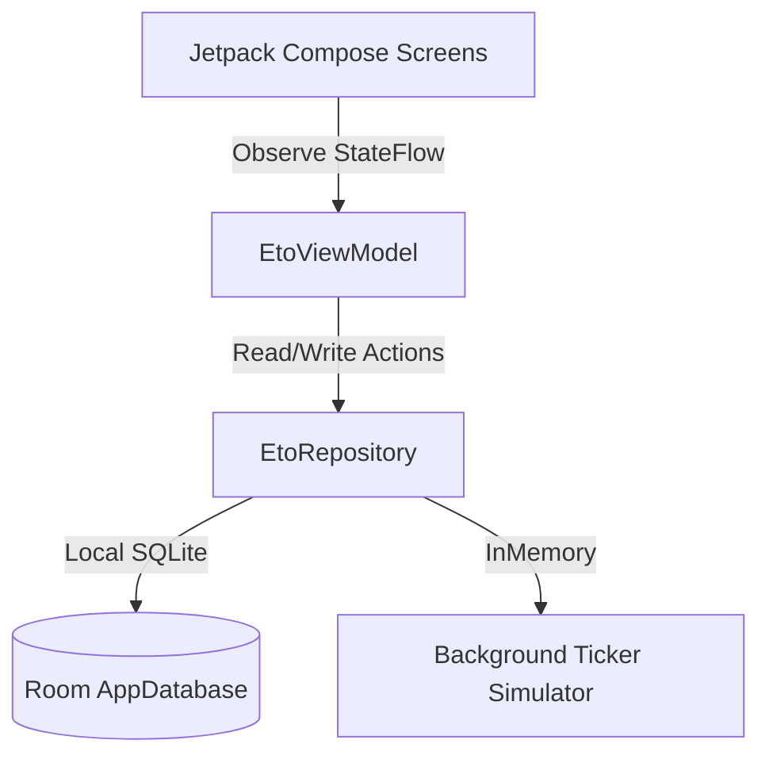

# ETO Android Application - Architecture Document

This document describes the software architecture, package structures, database schemas, and animation frameworks of the ETO mobile application.

---

## 🏛️ System Architecture

ETO is designed using Clean Architecture principles combined with the MVVM (Model-View-ViewModel) presentation pattern. This keeps business logic, database storage, and UI layouts separate and highly testable.



### Layer Breakdown

#### 1. Data Layer (`com.eto.manager.data`)
- **AppDatabase.kt**: Bootstraps the Room SQLite environment.
- **entity/Entities.kt**: Specifies structural schemas mapped to SQLite tables.
- **dao/EtoDao.kt**: Houses raw query commands for Doctors, Departments, and Tokens.
- **repository/EtoRepositoryImpl.kt**: Implements the Repository contract, retrieving offline data via Flow pipelines.

#### 2. Domain Layer (`com.eto.manager.domain`)
- **model/Models.kt**: Declares pure, framework-independent data classes (Models) for Doctors, Departments, and Tokens.
- **repository/EtoRepository.kt**: Outlines Repository interfaces, isolating business rules from data storage drivers.

#### 3. Presentation Layer (`com.eto.manager.presentation`)
- **theme/**: Formulates typography, color palettes, and global dark styles.
- **components/Components.kt**: Composes custom modifiers (`bounceClick`, `magnetEffect`, `shimmer`), shiny text masks, spotlight cards, empty state overlays, and notification feeds.
- **Views**:
  - `PatientView.kt`: Patient doctor lists and live Canvas progress circles.
  - `ReceptionistView.kt`: Front desk dashboard containing walk-in entry forms, approvals, and invoice records.
  - `DoctorView.kt`: Diagnosis entry forms and consultation workspaces.
  - `AdminView.kt`: Canvas-drawn interactive spline graphs.
- **EtoViewModel.kt**: Holds StateFlow UI variables and executes a background coroutine loop simulating live queue ticking.

---

## 🗄️ Database Schemas & Entities

ETO maintains state locally using SQLite via Room. The database tables are defined below:

### 1. Doctor Entity (`doctors` Table)
```kotlin
@Entity(tableName = "doctors")
data class DoctorEntity(
    @PrimaryKey val id: String,
    val name: String,
    val specialty: String,
    val departmentId: String,
    val departmentName: String,
    val averageServiceTimeMinutes: Int,
    val rating: Double,
    val isAvailable: Boolean
)
```

### 2. Department Entity (`departments` Table)
```kotlin
@Entity(tableName = "departments")
data class DepartmentEntity(
    @PrimaryKey val id: String,
    val name: String,
    val description: String
)
```

### 3. Token Entity (`tokens` Table)
```kotlin
@Entity(tableName = "tokens")
data class TokenEntity(
    @PrimaryKey val id: String,
    val tokenNumber: String,
    val patientName: String,
    val patientPhone: String,
    val doctorId: String,
    val doctorName: String,
    val departmentName: String,
    val status: String, // PENDING, SERVING, COMPLETED, SKIPPED, REJECTED
    val symptoms: String,
    val diagnosis: String? = null,
    val prescription: String? = null,
    val billAmount: Double = 0.0,
    val paymentStatus: String = "PENDING", // PENDING, PAID
    val estimatedWaitMinutes: Int = 0,
    val createdAt: Long = System.currentTimeMillis()
)
```

---

## 🎨 Interactive Canvas Components

### 1. Live Queue Progress Tracker
The tracker in the Patient Portal uses custom graphics instead of default components to draw:
- **Pulsing Outer Halos**: Renders double concentric rings scale-shifting continuously via `rememberInfiniteTransition`.
- **Sweep Gradient Arc**: Draws an arc with a dynamic `Brush.sweepGradient` to animate transition colors along the sweep angle.

### 2. Hourly Spline Graph
The Admin Portal analytics graph is built using Compose `Canvas` drawing operations:
- **Cubic Bezier curve**: Generates control coordinates based on horizontal scales to join hourly data points with smooth lines.
- **Entry Sweep**: Uses an entrance float animated by `animateFloatAsState` to slide lines from left to right on screen load.
- **Touch Tooltips**: Intercepts tap events on the Canvas, calculates proximity, highlights nodes with a halo circle, draws a dotted guide line, and renders a rounded tooltip overlay using `drawText`.
