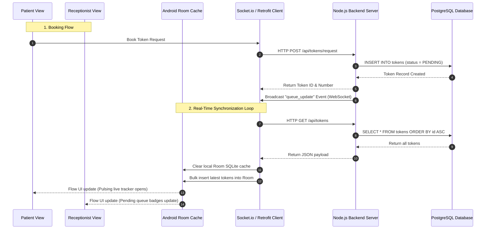

# ETO (Electronic Token Online) Hospital Queue Management System

ETO is a high-fidelity, real-time digital queue management system designed to replace traditional paper tokens in hospitals and clinics with an automated, synchronized workflow. 

The system consists of:
1. **A Native Android Mobile Application** built with **Kotlin**, **Jetpack Compose (Material 3)**, **Room SQLite Database**, and **Retrofit** following **Clean Architecture** patterns.
2. **A Node.js & Express API Backend** backed by a **PostgreSQL** database, utilizing **Socket.io** for real-time bi-directional events.

---

## 🏛️ System Architecture & Data Flow

The application coordinates state seamlessly between a persistent remote PostgreSQL server and local offline-capable Android devices via WebSocket updates.



### Component Breakdown

#### 1. Node.js Backend Server (`/server`)
* **REST API**: Handles transactional operations such as checking health, fetching departments/doctors, booking patient tokens, changing status states, finalizing consultations, and clearing logs.
* **PostgreSQL Integration (`pg` pool)**: Manages database connections and guarantees ACID transactions. Auto-creates tables and seeds default departments and doctors on launch.
* **Socket.io**: Listens for connection events and instantly broadcasts a `queue_update` ping whenever any write/update transaction completes, prompting clients to refresh.

#### 2. Android Client Application (`/app`)
* **Clean Architecture Layers**:
  * **Data Layer (`com.eto.manager.data`)**:
    * `AppDatabase.kt` & Room DAOs (`DoctorDao`, `DepartmentDao`, `TokenDao`) caching state locally.
    * `SocketManager.kt`: Connection manager for `socket.io-client`. Listens for the `queue_update` event.
    * `RetrofitClient.kt` & `ApiService.kt`: Type-safe HTTP REST definitions.
    * `EtoRepositoryImpl.kt`: Implements domain contracts, connecting local database queries (returning `Flow`) and scheduling network calls. Syncs the entire database downwards inside a background `CoroutineScope` whenever socket pings arrive.
  * **Domain Layer (`com.eto.manager.domain`)**:
    * Models (`Doctor`, `Token`, `Department`) and repository interfaces completely detached from frameworks.
  * **Presentation Layer (`com.eto.manager.presentation`)**:
    * `EtoViewModel.kt`: Operates on reactive MVVM flows via `StateFlow` variables. Schedules simulation tasks and switches user personas.
    * Views: Role-specific Compose views (`PatientView`, `ReceptionistView`, `DoctorView`, `AdminView`) and components.

---

## 🎨 Visual Identity & Premium Aesthetics

ETO is optimized with a sleek, dark-theme visual design system that aligns with premium hospital environments:
* **Midnight Dark Background (`#01082D`)**: Depth-inducing primary scaffold background.
* **Navy Deep (`#041D56`)**: Core cards, dashboard elements, and surfaces.
* **Steel Blue (`#266CA9`)**: Borders, selected tags, and interactive outlines.
* **Ice Cyan (`#ADE1FB`)**: Highlights, sweep circular gradients, and active trackers.

### Premium Physics-Based Animations (ReactBits Ports)
* **`bounceClick` Modifier**: Adds custom spring-physics scale feedback to button clicks.
* **`magnetEffect` Modifier**: Attracts components to the user's drag gestures, snapping back with spring physics.
* **`shimmer` Modifier**: An animated shader gradient simulating skeleton loaders.
* **`ShinyText`**: A shiny metallic reflection moving continuously across text headers.
* **`SpotlightCard`**: Radial touch-coordinate lighting following the user's fingers dynamically.
* **Concentric Live Queue Pulse**: A custom Canvas element that draws fading and scaling pulse rings for serving tokens.
* **Interactive Spline Line Chart**: An admin analytics line chart drawn on custom Canvas using cubic Bezier points, supporting entrance animations, node snapping, and touch tooltip indicators.

---

## 👥 Roles & Workflows

ETO features an app shell with a **Role Switcher** that allows testing all 4 key healthcare personas on a single device:

* **Patient Portal**:
  * Search and filter doctors by specialty, availability, and rating.
  * Enter chief complaints/symptoms to request online consultation tokens.
  * Monitor queue progression through an interactive circular live tracker (pulses dynamically via Socket.io updates).
  * View consultation history, diagnoses, prescriptions, and billing receipts.
  * Access the virtual SMS simulator drawer to read SMS updates.
* **Receptionist Dashboard**:
  * Approve or reject incoming online token requests.
  * Register walk-in patients directly into any doctor's waiting queue (creates APPROVED tokens).
  * Control doctor active queues (Call Next / Skip Patient).
  * Collect payments for completed consultations.
* **Doctor Consulting Desk**:
  * Select active doctor profile to load personal queue.
  * Open the Consultation Workspace for the patient currently in the room.
  * Input diagnosis, type prescriptions, and set consultation fees to finalize visits (moves token to COMPLETED).
* **Admin Dashboard**:
  * Analyze daily hospital analytics (peak load spline chart, total collections, skip rates).
  * Toggle the background simulation ticker (spawns simulated walk-ins and queue progression).
  * Clear consultation data to reset simulator logs.

---

## 🛠️ Installation & Setup

Follow these steps to set up the Postgres database, Node.js backend server, and build/run the Android application.

### 1. Backend Server Setup

#### Prerequisites
* **Node.js** (v18.0.0 or higher recommended)
* **PostgreSQL** installed and running

#### Environment Configuration
Navigate to the `/server` folder and create a `.env` file (or update the existing one):

```env
PORT=3000
PGHOST=localhost
PGUSER=postgres
PGPASSWORD=your_password
PGDATABASE=eto_db
PGPORT=5432
```
*Create the database `eto_db` manually in your PostgreSQL instance before starting the server.*

#### Install Dependencies and Run
From the root of the project:
```bash
# Navigate to the server folder
cd server

# Install Node modules
npm install

# Start the server (runs on port 3000 by default)
npm start

# Alternatively, run in development mode with automatic restarts on change
npm run dev
```
The server will initialize the database, verify/create tables (`departments`, `doctors`, `tokens`), and automatically seed mock doctors and departments.

---

### 2. Android Client Setup

#### Prerequisites
* **Android Studio** (Koala / Ladybug or newer recommended).
* **JDK 17 or 21** (Android Studio's internal bundled JDK is recommended).
* **Android SDK 34** (compileSdk & targetSdk).

#### Connection Endpoint Configuration
* **Emulator**: By default, the app is configured to connect to `10.0.2.2:3000`, which is the loopback alias pointing to your host computer from inside the Android Emulator.
* **Physical Device**: If you run the app on a physical phone connected over Wi-Fi, change the base addresses to matching values of your computer's local IP address (e.g. `192.168.1.50`):
  * Edit [SocketManager.kt](file:///home/karthi/Projects/Eto/app/src/main/java/com/eto/manager/data/remote/SocketManager.kt#L8):
    ```kotlin
    private const val SOCKET_URL = "http://192.168.1.50:3000"
    ```
  * Edit [RetrofitClient.kt](file:///home/karthi/Projects/Eto/app/src/main/java/com/eto/manager/data/remote/RetrofitClient.kt#L11):
    ```kotlin
    private const val BASE_URL = "http://192.168.1.50:3000/"
    ```

#### Run in Android Studio
1. Open **Android Studio** and choose **Open Project**.
2. Select `/home/karthi/Projects/Eto` as the root directory.
3. Wait for Android Studio to sync with Gradle files and download dependencies.
4. Select your target device (Emulator or USB Debugging physical phone).
5. Click **Run** (`Shift + F10`) to build, install, and launch the application.

#### Build via Command Line
```bash
# Generate a debug APK
./gradlew assembleDebug
```

---

## 📖 Step-by-Step E2E Usage Guide

Ensure the backend server is running and the Android client app is connected. Follow this workflow to verify the real-time pipeline:

### Step 1: Patient Books a Token
1. Launch the app (starts in **PATIENT** role).
2. Choose a doctor card (uses interactive radial `SpotlightCard` lighting).
3. Tap **Select Doctor** (note the physics-based `bounceClick` spring feedback).
4. Enter symptoms (e.g., *"Chest tightness and high heart rate"*) and tap **Book Token**.
5. The request is sent to the backend. You can open the **Virtual Phone Alerts** drawer (floating bell icon in top right) to view incoming booking notifications.

### Step 2: Front Desk Approval
1. Open the top-right role dropdown and switch to **RECEPTIONIST**.
2. Select the **Requests** tab in the bottom navigation.
3. Locate the pending token. Tap the **Approve** button (green check).
4. Switch back to the **PATIENT** role. The screen will dynamically display the **Live Queue Tracker** showing your token number, active position, and estimated wait minutes.

### Step 3: Doctor Consultation
1. Switch role to **RECEPTIONIST** and go to the **Queues** tab.
2. Select **Call Next** on the doctor's queue. The token status advances to `SERVING`.
3. Switch role to **DOCTOR** and choose the corresponding doctor's profile.
4. In the Consultation workspace, enter a Diagnosis (e.g. *"Angina pectoris"*), type a Prescription (e.g. *"Nitroglycerin 0.4mg"*), set a fee, and click **Finalize & Complete Consultation**.

### Step 4: Front Desk Billing Payment
1. Switch role to **RECEPTIONIST** and click the **Bills** tab.
2. The finalized invoice is visible. Tap **Record Cash Paid** (which uses a spring magnet attraction modifier) to mark the transaction as paid.

### Step 5: System Admin Monitoring & Ticker Simulation
1. Switch role to **ADMIN**.
2. Examine the live charts and collection aggregates on the dashboard.
3. Interact with the **Patient Flow Trend** spline chart by tapping points along the Canvas-drawn curve to snap dotted indicator guides and tooltip bubbles.
4. Toggle **Simulated Queue Ticker**. When enabled, a background coroutine loop will automatically post mock walk-ins and progress the queues, letting you observe active queue changes and alerts in real-time.

---

## 👨‍💻 Verification & Stability

* **Pointer Gesture Safety**: SpotlightCard touch indices are guarded against crashes (`firstOrNull()`).
* **Responsive Canvas Rendering**: Interactive spline charts and queue circles measure boundary sizes dynamically via `onSizeChanged` callbacks, scaling perfectly across different resolutions.
* **Coroutines Safety**: All networking and database transactions occur in background dispatcher contexts (`Dispatchers.IO`), keeping the main thread free and smooth.
