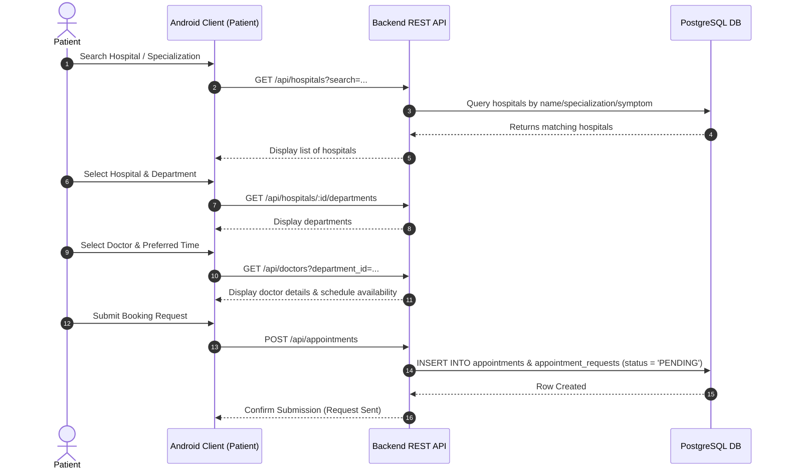
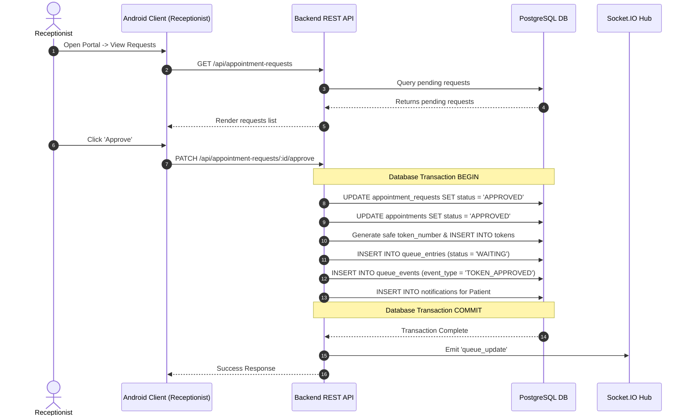
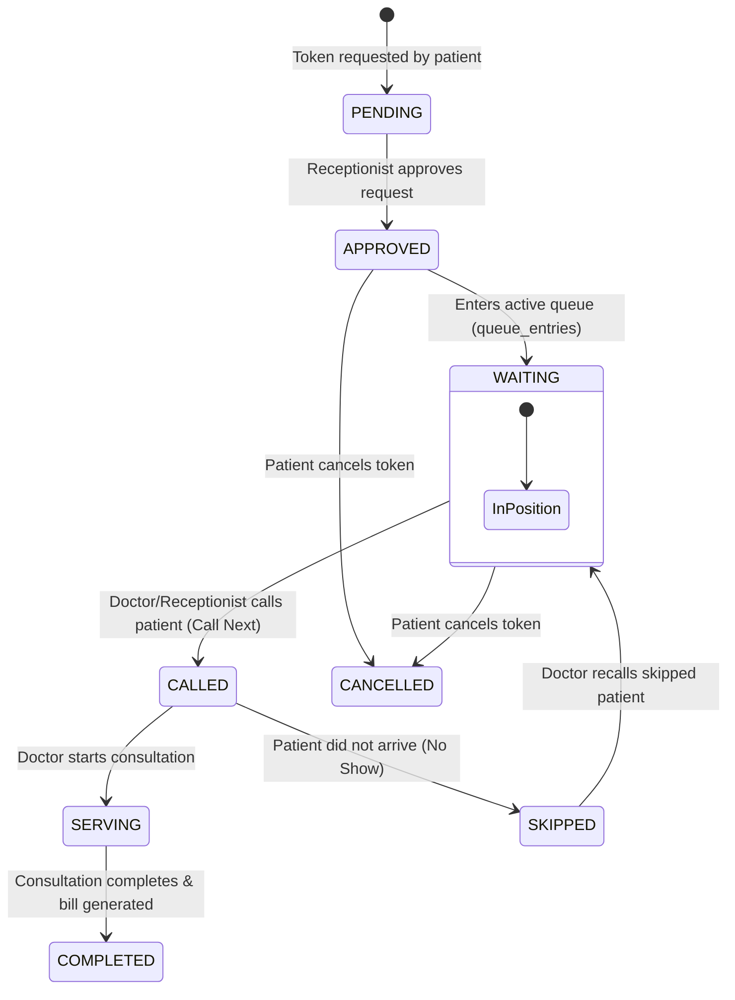
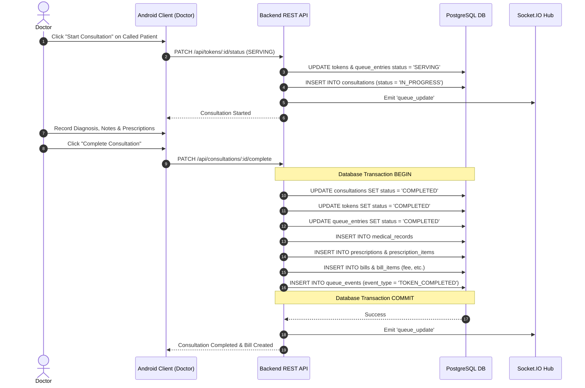
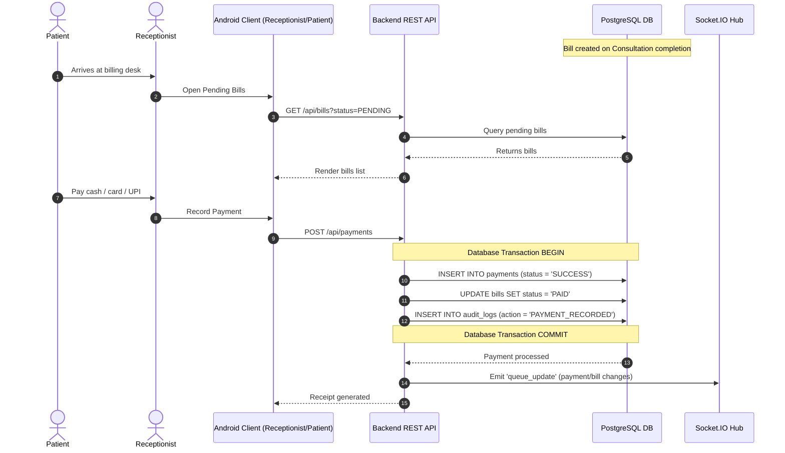
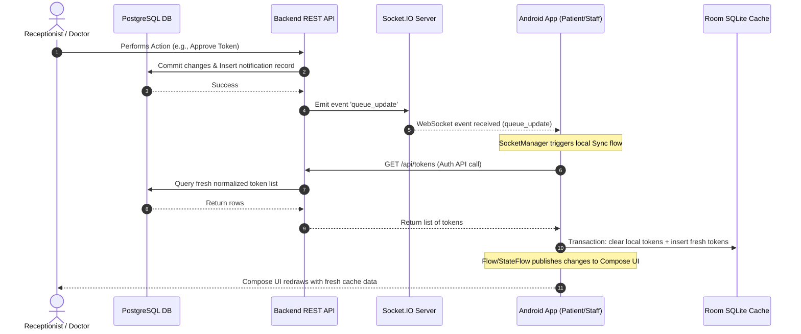

# ETO Data Flow Diagrams

This document contains flow diagrams mapping the primary workflows within the Electronic Token Online (ETO) system.

---

## 1. Patient Booking Flow
This maps how a Patient searches for a hospital, selects a doctor, and requests an appointment.

---

## 2. Receptionist Approval Flow
This maps how a receptionist reviews appointment requests and issues tokens.

---

## 3. Queue Progression Flow
This maps the progression of a token from waiting to serving or being skipped.

---

## 4. Doctor Consultation Flow
This maps the doctor's interaction during a clinical consultation, resulting in medical records and prescriptions.

---

## 5. Billing Flow
This maps how a bill is generated and paid.

---

## 6. Notifications & Real-Time Sync Flow
This maps how a database update triggers WebSocket updates and schedules a REST API sync on the Android App.

