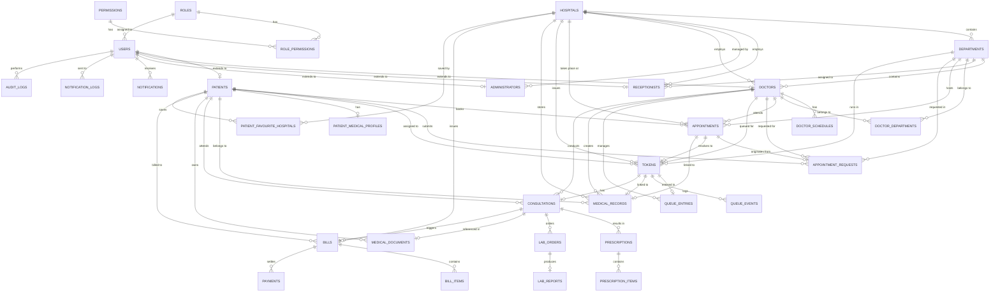

# ETO Relational Database Schema Document

This document defines the normalized PostgreSQL relational database schema for the ETO (Electronic Token Online) Hospital Management and Queue Management System.

---

## 1. ER Diagram (Mermaid)



---

## 2. Table Definitions

### 2.1 Role-Based Access Control (RBAC)

#### `roles`
* **Purpose**: User roles (e.g. PATIENT, DOCTOR, RECEPTIONIST, ADMIN).
* **Columns**:
  * `id` `VARCHAR(50)` PRIMARY KEY (e.g., `'PATIENT'`, `'DOCTOR'`)
  * `name` `VARCHAR(100)` NOT NULL UNIQUE
  * `description` `TEXT`

#### `permissions`
* **Purpose**: System-wide action privileges.
* **Columns**:
  * `id` `VARCHAR(50)` PRIMARY KEY (e.g., `'BOOK_APPOINTMENT'`)
  * `name` `VARCHAR(100)` NOT NULL UNIQUE
  * `description` `TEXT`

#### `role_permissions`
* **Purpose**: Many-to-many relationship mapping permissions to roles.
* **Columns**:
  * `role_id` `VARCHAR(50)` REFERENCES `roles(id)` ON DELETE CASCADE
  * `permission_id` `VARCHAR(50)` REFERENCES `permissions(id)` ON DELETE CASCADE
  * **Constraints**: PRIMARY KEY (`role_id`, `permission_id`)

---

### 2.2 Core User & Organization Entities

#### `users`
* **Purpose**: Centralized authentication and base profile table.
* **Columns**:
  * `id` `UUID` PRIMARY KEY DEFAULT `gen_random_uuid()`
  * `email` `VARCHAR(255)` UNIQUE
  * `phone` `VARCHAR(20)` UNIQUE
  * `password_hash` `VARCHAR(255)` NOT NULL
  * `role` `VARCHAR(50)` NOT NULL REFERENCES `roles(id)`
  * `first_name` `VARCHAR(100)` NOT NULL
  * `last_name` `VARCHAR(100)` NOT NULL
  * `profile_photo_url` `VARCHAR(512)`
  * `is_active` `BOOLEAN` NOT NULL DEFAULT `TRUE`
  * `is_verified` `BOOLEAN` NOT NULL DEFAULT `FALSE`
  * `created_at` `TIMESTAMP WITH TIME ZONE` NOT NULL DEFAULT `CURRENT_TIMESTAMP`
  * `updated_at` `TIMESTAMP WITH TIME ZONE` NOT NULL DEFAULT `CURRENT_TIMESTAMP`
  * `last_login_at` `TIMESTAMP WITH TIME ZONE`
* **Indexes**:
  * `idx_users_email` (UNIQUE) on `email`
  * `idx_users_phone` (UNIQUE) on `phone`

#### `hospitals`
* **Purpose**: Organizations containing departments, doctors, and staff.
* **Columns**:
  * `id` `UUID` PRIMARY KEY DEFAULT `gen_random_uuid()`
  * `name` `VARCHAR(255)` NOT NULL
  * `registration_number` `VARCHAR(100)` UNIQUE NOT NULL
  * `description` `TEXT`
  * `phone` `VARCHAR(20)`
  * `email` `VARCHAR(255)`
  * `address_line` `VARCHAR(255)`
  * `city` `VARCHAR(100)`
  * `state` `VARCHAR(100)`
  * `postal_code` `VARCHAR(20)`
  * `latitude` `DECIMAL(9, 6)`
  * `longitude` `DECIMAL(9, 6)`
  * `opening_time` `TIME`
  * `closing_time` `TIME`
  * `timezone` `VARCHAR(100)` DEFAULT `'Asia/Kolkata'`
  * `logo_url` `VARCHAR(512)`
  * `is_active` `BOOLEAN` NOT NULL DEFAULT `TRUE`
  * `created_at` `TIMESTAMP WITH TIME ZONE` NOT NULL DEFAULT `CURRENT_TIMESTAMP`
  * `updated_at` `TIMESTAMP WITH TIME ZONE` NOT NULL DEFAULT `CURRENT_TIMESTAMP`

#### `departments`
* **Purpose**: Specific medical department fields within a hospital.
* **Columns**:
  * `id` `UUID` PRIMARY KEY DEFAULT `gen_random_uuid()`
  * `hospital_id` `UUID` NOT NULL REFERENCES `hospitals(id)` ON DELETE CASCADE
  * `name` `VARCHAR(100)` NOT NULL
  * `description` `TEXT`
  * `specialization` `VARCHAR(100)`
  * `is_active` `BOOLEAN` NOT NULL DEFAULT `TRUE`
  * `created_at` `TIMESTAMP WITH TIME ZONE` NOT NULL DEFAULT `CURRENT_TIMESTAMP`
  * `updated_at` `TIMESTAMP WITH TIME ZONE` NOT NULL DEFAULT `CURRENT_TIMESTAMP`
* **Constraints**: UNIQUE (`hospital_id`, `name`)

#### `patients`
* **Purpose**: Patient profiles linked to user profiles.
* **Columns**:
  * `id` `UUID` PRIMARY KEY DEFAULT `gen_random_uuid()`
  * `user_id` `UUID` NOT NULL REFERENCES `users(id)` ON DELETE CASCADE UNIQUE
  * `patient_number` `VARCHAR(50)` UNIQUE NOT NULL
  * `date_of_birth` `DATE`
  * `gender` `VARCHAR(20)` CHECK (`gender` IN ('MALE', 'FEMALE', 'OTHER'))
  * `blood_group` `VARCHAR(10)` CHECK (`blood_group` IN ('A+', 'A-', 'B+', 'B-', 'AB+', 'AB-', 'O+', 'O-', 'UNKNOWN'))
  * `address` `TEXT`
  * `emergency_contact_name` `VARCHAR(100)`
  * `emergency_contact_phone` `VARCHAR(20)`
  * `created_at` `TIMESTAMP WITH TIME ZONE` NOT NULL DEFAULT `CURRENT_TIMESTAMP`
  * `updated_at` `TIMESTAMP WITH TIME ZONE` NOT NULL DEFAULT `CURRENT_TIMESTAMP`
* **Indexes**:
  * `idx_patients_patient_number` (UNIQUE) on `patient_number`

#### `doctors`
* **Purpose**: Doctor profiles linked to user profiles.
* **Columns**:
  * `id` `UUID` PRIMARY KEY DEFAULT `gen_random_uuid()`
  * `user_id` `UUID` NOT NULL REFERENCES `users(id)` ON DELETE CASCADE UNIQUE
  * `doctor_number` `VARCHAR(50)` UNIQUE NOT NULL
  * `specialization` `VARCHAR(100)` NOT NULL
  * `qualification` `VARCHAR(100)` NOT NULL
  * `experience_years` `INT` NOT NULL DEFAULT 0 CHECK (`experience_years` >= 0)
  * `consultation_fee` `DECIMAL(10, 2)` NOT NULL DEFAULT 0.0 CHECK (`consultation_fee` >= 0)
  * `bio` `TEXT`
  * `hospital_id` `UUID` NOT NULL REFERENCES `hospitals(id)` ON DELETE CASCADE
  * `department_id` `UUID` REFERENCES `departments(id)` ON DELETE SET NULL
  * `consultation_room` `VARCHAR(50)`
  * `is_available` `BOOLEAN` NOT NULL DEFAULT `TRUE`
  * `created_at` `TIMESTAMP WITH TIME ZONE` NOT NULL DEFAULT `CURRENT_TIMESTAMP`
  * `updated_at` `TIMESTAMP WITH TIME ZONE` NOT NULL DEFAULT `CURRENT_TIMESTAMP`
* **Indexes**:
  * `idx_doctors_hospital_id` on `hospital_id`
  * `idx_doctors_department_id` on `department_id`
  * `idx_doctors_is_available` on `is_available`

#### `doctor_departments`
* **Purpose**: Many-to-many relationship supporting doctors in multiple departments.
* **Columns**:
  * `doctor_id` `UUID` NOT NULL REFERENCES `doctors(id)` ON DELETE CASCADE
  * `department_id` `UUID` NOT NULL REFERENCES `departments(id)` ON DELETE CASCADE
  * `is_primary` `BOOLEAN` NOT NULL DEFAULT `TRUE`
  * `created_at` `TIMESTAMP WITH TIME ZONE` NOT NULL DEFAULT `CURRENT_TIMESTAMP`
* **Constraints**: PRIMARY KEY (`doctor_id`, `department_id`)

#### `doctor_schedules`
* **Purpose**: Doctor availability slots mapped by day of week.
* **Columns**:
  * `id` `UUID` PRIMARY KEY DEFAULT `gen_random_uuid()`
  * `doctor_id` `UUID` NOT NULL REFERENCES `doctors(id)` ON DELETE CASCADE
  * `day_of_week` `INT` NOT NULL CHECK (`day_of_week` BETWEEN 0 AND 6) -- 0 = Sunday, 1 = Monday, etc.
  * `start_time` `TIME` NOT NULL
  * `end_time` `TIME` NOT NULL
  * `appointment_duration_minutes` `INT` NOT NULL DEFAULT 15 CHECK (`appointment_duration_minutes` > 0)
  * `max_patients` `INT` NOT NULL CHECK (`max_patients` > 0)
  * `is_active` `BOOLEAN` NOT NULL DEFAULT `TRUE`
* **Constraints**: CHECK (`start_time` < `end_time`)

#### `receptionists`
* **Purpose**: Receptionist employee records.
* **Columns**:
  * `id` `UUID` PRIMARY KEY DEFAULT `gen_random_uuid()`
  * `user_id` `UUID` NOT NULL REFERENCES `users(id)` ON DELETE CASCADE UNIQUE
  * `employee_number` `VARCHAR(50)` UNIQUE NOT NULL
  * `hospital_id` `UUID` NOT NULL REFERENCES `hospitals(id)` ON DELETE CASCADE
  * `department_id` `UUID` REFERENCES `departments(id)` ON DELETE SET NULL
  * `designation` `VARCHAR(100)`
  * `shift` `VARCHAR(50)` -- e.g. 'MORNING', 'EVENING', 'NIGHT'
  * `joining_date` `DATE`
  * `is_active` `BOOLEAN` NOT NULL DEFAULT `TRUE`
  * `created_at` `TIMESTAMP WITH TIME ZONE` NOT NULL DEFAULT `CURRENT_TIMESTAMP`
  * `updated_at` `TIMESTAMP WITH TIME ZONE` NOT NULL DEFAULT `CURRENT_TIMESTAMP`

#### `administrators`
* **Purpose**: Admin employee records (system and hospital levels).
* **Columns**:
  * `id` `UUID` PRIMARY KEY DEFAULT `gen_random_uuid()`
  * `user_id` `UUID` NOT NULL REFERENCES `users(id)` ON DELETE CASCADE UNIQUE
  * `hospital_id` `UUID` REFERENCES `hospitals(id)` ON DELETE CASCADE -- NULL for system-wide Admins
  * `admin_level` `VARCHAR(50)` NOT NULL -- e.g., 'SYSTEM', 'HOSPITAL'
  * `is_active` `BOOLEAN` NOT NULL DEFAULT `TRUE`
  * `created_at` `TIMESTAMP WITH TIME ZONE` NOT NULL DEFAULT `CURRENT_TIMESTAMP`
  * `updated_at` `TIMESTAMP WITH TIME ZONE` NOT NULL DEFAULT `CURRENT_TIMESTAMP`

---

### 2.3 Appointments & Token Queue System

#### `appointments`
* **Purpose**: Scheduled appointments.
* **Columns**:
  * `id` `UUID` PRIMARY KEY DEFAULT `gen_random_uuid()`
  * `patient_id` `UUID` NOT NULL REFERENCES `patients(id)` ON DELETE CASCADE
  * `doctor_id` `UUID` NOT NULL REFERENCES `doctors(id)` ON DELETE CASCADE
  * `department_id` `UUID` NOT NULL REFERENCES `departments(id)` ON DELETE CASCADE
  * `hospital_id` `UUID` NOT NULL REFERENCES `hospitals(id)` ON DELETE CASCADE
  * `appointment_date` `DATE` NOT NULL
  * `appointment_time` `TIME` NOT NULL
  * `appointment_type` `VARCHAR(50)` NOT NULL CHECK (`appointment_type` IN ('ONLINE', 'WALK_IN', 'FOLLOW_UP', 'EMERGENCY'))
  * `status` `VARCHAR(50)` NOT NULL DEFAULT `'REQUESTED'` CHECK (`status` IN ('REQUESTED', 'APPROVED', 'REJECTED', 'CANCELLED', 'CHECKED_IN', 'COMPLETED', 'NO_SHOW'))
  * `reason_for_visit` `TEXT`
  * `symptoms` `TEXT`
  * `notes` `TEXT`
  * `created_at` `TIMESTAMP WITH TIME ZONE` NOT NULL DEFAULT `CURRENT_TIMESTAMP`
  * `updated_at` `TIMESTAMP WITH TIME ZONE` NOT NULL DEFAULT `CURRENT_TIMESTAMP`
* **Indexes**:
  * `idx_appointments_patient_id` on `patient_id`
  * `idx_appointments_doctor_id` on `doctor_id`
  * `idx_appointments_date_status` on (`appointment_date`, `status`)

#### `appointment_requests`
* **Purpose**: Pending booking requests from patients needing approval.
* **Columns**:
  * `id` `UUID` PRIMARY KEY DEFAULT `gen_random_uuid()`
  * `appointment_id` `UUID` REFERENCES `appointments(id)` ON DELETE SET NULL
  * `patient_id` `UUID` NOT NULL REFERENCES `patients(id)` ON DELETE CASCADE
  * `requested_doctor_id` `UUID` NOT NULL REFERENCES `doctors(id)` ON DELETE CASCADE
  * `requested_department_id` `UUID` NOT NULL REFERENCES `departments(id)` ON DELETE CASCADE
  * `requested_date` `DATE` NOT NULL
  * `requested_time` `TIME` NOT NULL
  * `reason` `TEXT`
  * `symptoms` `TEXT`
  * `priority` `VARCHAR(50)` NOT NULL DEFAULT 'NORMAL' CHECK (`priority` IN ('LOW', 'NORMAL', 'HIGH', 'EMERGENCY'))
  * `status` `VARCHAR(50)` NOT NULL DEFAULT 'PENDING' CHECK (`status` IN ('PENDING', 'APPROVED', 'REJECTED', 'CANCELLED'))
  * `rejection_reason` `TEXT`
  * `reviewed_by` `UUID` REFERENCES `users(id)` ON DELETE SET NULL
  * `reviewed_at` `TIMESTAMP WITH TIME ZONE`
  * `created_at` `TIMESTAMP WITH TIME ZONE` NOT NULL DEFAULT `CURRENT_TIMESTAMP`
  * `updated_at` `TIMESTAMP WITH TIME ZONE` NOT NULL DEFAULT `CURRENT_TIMESTAMP`

#### `tokens`
* **Purpose**: Core entity for the EToken queue system.
* **Columns**:
  * `id` `UUID` PRIMARY KEY DEFAULT `gen_random_uuid()`
  * `token_number` `VARCHAR(50)` NOT NULL
  * `patient_id` `UUID` NOT NULL REFERENCES `patients(id)` ON DELETE CASCADE
  * `appointment_id` `UUID` REFERENCES `appointments(id)` ON DELETE SET NULL
  * `hospital_id` `UUID` NOT NULL REFERENCES `hospitals(id)` ON DELETE CASCADE
  * `department_id` `UUID` NOT NULL REFERENCES `departments(id)` ON DELETE CASCADE
  * `doctor_id` `UUID` NOT NULL REFERENCES `doctors(id)` ON DELETE CASCADE
  * `queue_date` `DATE` NOT NULL
  * `priority` `VARCHAR(50)` NOT NULL DEFAULT 'NORMAL' CHECK (`priority` IN ('LOW', 'NORMAL', 'HIGH', 'EMERGENCY'))
  * `source` `VARCHAR(50)` NOT NULL CHECK (`source` IN ('ONLINE', 'WALK_IN', 'APPOINTMENT', 'EMERGENCY'))
  * `status` `VARCHAR(50)` NOT NULL DEFAULT 'PENDING' CHECK (`status` IN ('PENDING', 'APPROVED', 'WAITING', 'CALLED', 'SERVING', 'SKIPPED', 'COMPLETED', 'CANCELLED', 'NO_SHOW'))
  * `requested_at` `TIMESTAMP WITH TIME ZONE` NOT NULL DEFAULT `CURRENT_TIMESTAMP`
  * `approved_at` `TIMESTAMP WITH TIME ZONE`
  * `called_at` `TIMESTAMP WITH TIME ZONE`
  * `serving_at` `TIMESTAMP WITH TIME ZONE`
  * `completed_at` `TIMESTAMP WITH TIME ZONE`
  * `cancelled_at` `TIMESTAMP WITH TIME ZONE`
  * `skipped_at` `TIMESTAMP WITH TIME ZONE`
  * `estimated_wait_minutes` `INT` NOT NULL DEFAULT 0
  * `created_by` `UUID` NOT NULL REFERENCES `users(id)` ON DELETE RESTRICT
  * `approved_by` `UUID` REFERENCES `users(id)` ON DELETE SET NULL
  * `created_at` `TIMESTAMP WITH TIME ZONE` NOT NULL DEFAULT `CURRENT_TIMESTAMP`
  * `updated_at` `TIMESTAMP WITH TIME ZONE` NOT NULL DEFAULT `CURRENT_TIMESTAMP`
* **Constraints**:
  * UNIQUE (`hospital_id`, `doctor_id`, `queue_date`, `token_number`)
* **Indexes**:
  * `idx_tokens_doctor_date` on (`doctor_id`, `queue_date`)
  * `idx_tokens_patient_id` on `patient_id`
  * `idx_tokens_status` on `status`

#### `queue_entries`
* **Purpose**: Active, sorted digital queue representation for the doctor.
* **Columns**:
  * `id` `UUID` PRIMARY KEY DEFAULT `gen_random_uuid()`
  * `token_id` `UUID` NOT NULL REFERENCES `tokens(id)` ON DELETE CASCADE UNIQUE
  * `doctor_id` `UUID` NOT NULL REFERENCES `doctors(id)` ON DELETE CASCADE
  * `queue_date` `DATE` NOT NULL
  * `position` `INT` NOT NULL
  * `status` `VARCHAR(50)` NOT NULL CHECK (`status` IN ('WAITING', 'CALLED', 'SERVING', 'SKIPPED', 'COMPLETED'))
  * `priority` `VARCHAR(50)` NOT NULL DEFAULT 'NORMAL' CHECK (`priority` IN ('LOW', 'NORMAL', 'HIGH', 'EMERGENCY'))
  * `joined_at` `TIMESTAMP WITH TIME ZONE` NOT NULL DEFAULT `CURRENT_TIMESTAMP`
  * `called_at` `TIMESTAMP WITH TIME ZONE`
  * `completed_at` `TIMESTAMP WITH TIME ZONE`
  * `skipped_at` `TIMESTAMP WITH TIME ZONE`
* **Indexes**:
  * `idx_queue_entries_doctor_date_status` on (`doctor_id`, `queue_date`, `status`)
  * `idx_queue_entries_ordering` on (`doctor_id`, `queue_date`, `priority`, `position`, `joined_at`)

#### `queue_events`
* **Purpose**: Immutable historical events for queue audits.
* **Columns**:
  * `id` `UUID` PRIMARY KEY DEFAULT `gen_random_uuid()`
  * `token_id` `UUID` NOT NULL REFERENCES `tokens(id)` ON DELETE CASCADE
  * `event_type` `VARCHAR(100)` NOT NULL CHECK (`event_type` IN ('TOKEN_CREATED', 'TOKEN_APPROVED', 'TOKEN_REJECTED', 'TOKEN_CALLED', 'TOKEN_SERVING', 'TOKEN_SKIPPED', 'TOKEN_RECALLED', 'TOKEN_COMPLETED', 'TOKEN_CANCELLED'))
  * `old_status` `VARCHAR(50)`
  * `new_status` `VARCHAR(50)` NOT NULL
  * `performed_by` `UUID` REFERENCES `users(id)` ON DELETE SET NULL
  * `metadata` `JSONB`
  * `created_at` `TIMESTAMP WITH TIME ZONE` NOT NULL DEFAULT `CURRENT_TIMESTAMP`

---

### 2.4 Patient Medical Profiles & Records

#### `patient_medical_profiles`
* **Purpose**: Basic chronic medical profile for patients.
* **Columns**:
  * `id` `UUID` PRIMARY KEY DEFAULT `gen_random_uuid()`
  * `patient_id` `UUID` NOT NULL REFERENCES `patients(id)` ON DELETE CASCADE UNIQUE
  * `blood_group` `VARCHAR(10)`
  * `allergies` `TEXT`
  * `chronic_conditions` `TEXT`
  * `current_medications` `TEXT`
  * `created_at` `TIMESTAMP WITH TIME ZONE` NOT NULL DEFAULT `CURRENT_TIMESTAMP`
  * `updated_at` `TIMESTAMP WITH TIME ZONE` NOT NULL DEFAULT `CURRENT_TIMESTAMP`

#### `consultations`
* **Purpose**: Specific doctor consultation details linked to a token.
* **Columns**:
  * `id` `UUID` PRIMARY KEY DEFAULT `gen_random_uuid()`
  * `token_id` `UUID` NOT NULL REFERENCES `tokens(id)` ON DELETE CASCADE UNIQUE
  * `patient_id` `UUID` NOT NULL REFERENCES `patients(id)` ON DELETE CASCADE
  * `doctor_id` `UUID` NOT NULL REFERENCES `doctors(id)` ON DELETE CASCADE
  * `started_at` `TIMESTAMP WITH TIME ZONE` NOT NULL DEFAULT `CURRENT_TIMESTAMP`
  * `completed_at` `TIMESTAMP WITH TIME ZONE`
  * `diagnosis` `TEXT`
  * `notes` `TEXT`
  * `follow_up_date` `DATE`
  * `consultation_fee` `DECIMAL(10, 2)` NOT NULL DEFAULT 0.0 CHECK (`consultation_fee` >= 0)
  * `status` `VARCHAR(50)` NOT NULL DEFAULT 'IN_PROGRESS' CHECK (`status` IN ('IN_PROGRESS', 'COMPLETED', 'CANCELLED'))
  * `created_at` `TIMESTAMP WITH TIME ZONE` NOT NULL DEFAULT `CURRENT_TIMESTAMP`
  * `updated_at` `TIMESTAMP WITH TIME ZONE` NOT NULL DEFAULT `CURRENT_TIMESTAMP`

#### `medical_records`
* **Purpose**: Permanent legal electronic medical records (EMR) for hospital stays / consultations.
* **Columns**:
  * `id` `UUID` PRIMARY KEY DEFAULT `gen_random_uuid()`
  * `patient_id` `UUID` NOT NULL REFERENCES `patients(id)` ON DELETE CASCADE
  * `doctor_id` `UUID` NOT NULL REFERENCES `doctors(id)` ON DELETE CASCADE
  * `hospital_id` `UUID` NOT NULL REFERENCES `hospitals(id)` ON DELETE CASCADE
  * `appointment_id` `UUID` REFERENCES `appointments(id)` ON DELETE SET NULL
  * `token_id` `UUID` REFERENCES `tokens(id)` ON DELETE SET NULL
  * `diagnosis` `TEXT`
  * `symptoms` `TEXT`
  * `clinical_notes` `TEXT`
  * `treatment_notes` `TEXT`
  * `follow_up_date` `DATE`
  * `created_at` `TIMESTAMP WITH TIME ZONE` NOT NULL DEFAULT `CURRENT_TIMESTAMP`
  * `updated_at` `TIMESTAMP WITH TIME ZONE` NOT NULL DEFAULT `CURRENT_TIMESTAMP`

#### `prescriptions`
* **Purpose**: Prescriptions written during consultations.
* **Columns**:
  * `id` `UUID` PRIMARY KEY DEFAULT `gen_random_uuid()`
  * `consultation_id` `UUID` NOT NULL REFERENCES `consultations(id)` ON DELETE CASCADE
  * `patient_id` `UUID` NOT NULL REFERENCES `patients(id)` ON DELETE CASCADE
  * `doctor_id` `UUID` NOT NULL REFERENCES `doctors(id)` ON DELETE CASCADE
  * `prescription_number` `VARCHAR(100)` UNIQUE NOT NULL
  * `instructions` `TEXT`
  * `created_at` `TIMESTAMP WITH TIME ZONE` NOT NULL DEFAULT `CURRENT_TIMESTAMP`

#### `prescription_items`
* **Purpose**: Single items inside a prescription list.
* **Columns**:
  * `id` `UUID` PRIMARY KEY DEFAULT `gen_random_uuid()`
  * `prescription_id` `UUID` NOT NULL REFERENCES `prescriptions(id)` ON DELETE CASCADE
  * `medicine_name` `VARCHAR(255)` NOT NULL
  * `dosage` `VARCHAR(100)` NOT NULL -- e.g. "500mg"
  * `frequency` `VARCHAR(100)` NOT NULL -- e.g. "1-0-1" or "Three times a day"
  * `duration` `VARCHAR(100)` NOT NULL -- e.g. "5 days"
  * `route` `VARCHAR(100)` -- e.g. "ORAL", "TOPICAL"
  * `instructions` `TEXT`

#### `lab_orders`
* **Purpose**: Test orders made during consultations.
* **Columns**:
  * `id` `UUID` PRIMARY KEY DEFAULT `gen_random_uuid()`
  * `consultation_id` `UUID` NOT NULL REFERENCES `consultations(id)` ON DELETE CASCADE
  * `patient_id` `UUID` NOT NULL REFERENCES `patients(id)` ON DELETE CASCADE
  * `doctor_id` `UUID` NOT NULL REFERENCES `doctors(id)` ON DELETE CASCADE
  * `test_name` `VARCHAR(255)` NOT NULL
  * `instructions` `TEXT`
  * `status` `VARCHAR(50)` NOT NULL DEFAULT 'ORDERED' CHECK (`status` IN ('ORDERED', 'IN_PROGRESS', 'COMPLETED', 'CANCELLED'))
  * `ordered_at` `TIMESTAMP WITH TIME ZONE` NOT NULL DEFAULT `CURRENT_TIMESTAMP`
  * `completed_at` `TIMESTAMP WITH TIME ZONE`

#### `lab_reports`
* **Purpose**: Test results for lab orders.
* **Columns**:
  * `id` `UUID` PRIMARY KEY DEFAULT `gen_random_uuid()`
  * `lab_order_id` `UUID` NOT NULL REFERENCES `lab_orders(id)` ON DELETE CASCADE
  * `patient_id` `UUID` NOT NULL REFERENCES `patients(id)` ON DELETE CASCADE
  * `report_name` `VARCHAR(255)` NOT NULL
  * `result_summary` `TEXT`
  * `report_file_url` `VARCHAR(512)`
  * `reported_at` `TIMESTAMP WITH TIME ZONE` NOT NULL DEFAULT `CURRENT_TIMESTAMP`
  * `uploaded_at` `TIMESTAMP WITH TIME ZONE` NOT NULL DEFAULT `CURRENT_TIMESTAMP`

#### `medical_documents`
* **Purpose**: General uploaded files (scans, reports, prescription slips, certs).
* **Columns**:
  * `id` `UUID` PRIMARY KEY DEFAULT `gen_random_uuid()`
  * `patient_id` `UUID` NOT NULL REFERENCES `patients(id)` ON DELETE CASCADE
  * `consultation_id` `UUID` REFERENCES `consultations(id)` ON DELETE SET NULL
  * `document_type` `VARCHAR(50)` NOT NULL CHECK (`document_type` IN ('LAB_REPORT', 'PRESCRIPTION', 'SCAN', 'MEDICAL_CERTIFICATE', 'OTHER'))
  * `title` `VARCHAR(255)` NOT NULL
  * `file_url` `VARCHAR(512)` NOT NULL
  * `uploaded_by` `UUID` REFERENCES `users(id)` ON DELETE SET NULL
  * `created_at` `TIMESTAMP WITH TIME ZONE` NOT NULL DEFAULT `CURRENT_TIMESTAMP`

---

### 2.5 Billing & Payments

#### `bills`
* **Purpose**: Billing record generated for appointments / consultations.
* **Columns**:
  * `id` `UUID` PRIMARY KEY DEFAULT `gen_random_uuid()`
  * `bill_number` `VARCHAR(100)` UNIQUE NOT NULL
  * `patient_id` `UUID` NOT NULL REFERENCES `patients(id)` ON DELETE CASCADE
  * `hospital_id` `UUID` NOT NULL REFERENCES `hospitals(id)` ON DELETE CASCADE
  * `appointment_id` `UUID` REFERENCES `appointments(id)` ON DELETE SET NULL
  * `token_id` `UUID` REFERENCES `tokens(id)` ON DELETE SET NULL
  * `consultation_id` `UUID` REFERENCES `consultations(id)` ON DELETE SET NULL
  * `subtotal` `DECIMAL(10, 2)` NOT NULL CHECK (`subtotal` >= 0)
  * `discount` `DECIMAL(10, 2)` NOT NULL DEFAULT 0.0 CHECK (`discount` >= 0)
  * `tax` `DECIMAL(10, 2)` NOT NULL DEFAULT 0.0 CHECK (`tax` >= 0)
  * `total_amount` `DECIMAL(10, 2)` NOT NULL CHECK (`total_amount` >= 0)
  * `status` `VARCHAR(50)` NOT NULL DEFAULT 'PENDING' CHECK (`status` IN ('PENDING', 'PARTIALLY_PAID', 'PAID', 'CANCELLED'))
  * `created_by` `UUID` NOT NULL REFERENCES `users(id)` ON DELETE RESTRICT
  * `created_at` `TIMESTAMP WITH TIME ZONE` NOT NULL DEFAULT `CURRENT_TIMESTAMP`
  * `updated_at` `TIMESTAMP WITH TIME ZONE` NOT NULL DEFAULT `CURRENT_TIMESTAMP`
* **Indexes**:
  * `idx_bills_patient_id` on `patient_id`
  * `idx_bills_status` on `status`

#### `bill_items`
* **Purpose**: Single lines on a bill.
* **Columns**:
  * `id` `UUID` PRIMARY KEY DEFAULT `gen_random_uuid()`
  * `bill_id` `UUID` NOT NULL REFERENCES `bills(id)` ON DELETE CASCADE
  * `item_type` `VARCHAR(50)` NOT NULL CHECK (`item_type` IN ('CONSULTATION', 'LAB_TEST', 'MEDICINE', 'OTHER'))
  * `description` `TEXT` NOT NULL
  * `quantity` `INT` NOT NULL DEFAULT 1 CHECK (`quantity` > 0)
  * `unit_price` `DECIMAL(10, 2)` NOT NULL CHECK (`unit_price` >= 0)
  * `total_price` `DECIMAL(10, 2)` NOT NULL CHECK (`total_price` >= 0)

#### `payments`
* **Purpose**: Records of payments received.
* **Columns**:
  * `id` `UUID` PRIMARY KEY DEFAULT `gen_random_uuid()`
  * `bill_id` `UUID` NOT NULL REFERENCES `bills(id)` ON DELETE CASCADE
  * `amount` `DECIMAL(10, 2)` NOT NULL CHECK (`amount` > 0)
  * `payment_method` `VARCHAR(50)` NOT NULL CHECK (`payment_method` IN ('CASH', 'CARD', 'UPI', 'ONLINE', 'WALLET'))
  * `transaction_id` `VARCHAR(255)`
  * `payment_status` `VARCHAR(50)` NOT NULL CHECK (`payment_status` IN ('PENDING', 'SUCCESS', 'FAILED'))
  * `paid_by` `UUID` REFERENCES `users(id)` ON DELETE SET NULL
  * `paid_at` `TIMESTAMP WITH TIME ZONE` NOT NULL DEFAULT `CURRENT_TIMESTAMP`
  * `created_at` `TIMESTAMP WITH TIME ZONE` NOT NULL DEFAULT `CURRENT_TIMESTAMP`

---

### 2.6 Notifications & Infrastructure Logs

#### `notifications`
* **Purpose**: Patient/Staff alerts.
* **Columns**:
  * `id` `UUID` PRIMARY KEY DEFAULT `gen_random_uuid()`
  * `user_id` `UUID` NOT NULL REFERENCES `users(id)` ON DELETE CASCADE
  * `type` `VARCHAR(100)` NOT NULL -- e.g., 'TOKEN_APPROVED', 'YOUR_TURN'
  * `title` `VARCHAR(255)` NOT NULL
  * `message` `TEXT` NOT NULL
  * `related_entity_type` `VARCHAR(100)`
  * `related_entity_id` `UUID`
  * `is_read` `BOOLEAN` NOT NULL DEFAULT `FALSE`
  * `created_at` `TIMESTAMP WITH TIME ZONE` NOT NULL DEFAULT `CURRENT_TIMESTAMP`
  * `read_at` `TIMESTAMP WITH TIME ZONE`
* **Indexes**:
  * `idx_notifications_user_unread` on (`user_id`, `is_read`)

#### `notification_logs`
* **Purpose**: Sent transmission logs (Push, SMS, Email).
* **Columns**:
  * `id` `UUID` PRIMARY KEY DEFAULT `gen_random_uuid()`
  * `user_id` `UUID` NOT NULL REFERENCES `users(id)` ON DELETE CASCADE
  * `notification_type` `VARCHAR(100)` NOT NULL
  * `channel` `VARCHAR(50)` NOT NULL CHECK (`channel` IN ('PUSH', 'SMS', 'EMAIL'))
  * `recipient` `VARCHAR(255)` NOT NULL
  * `message` `TEXT` NOT NULL
  * `status` `VARCHAR(100)` NOT NULL -- e.g., 'SENT', 'DELIVERED', 'FAILED'
  * `provider_message_id` `VARCHAR(255)`
  * `sent_at` `TIMESTAMP WITH TIME ZONE`
  * `delivered_at` `TIMESTAMP WITH TIME ZONE`
  * `created_at` `TIMESTAMP WITH TIME ZONE` NOT NULL DEFAULT `CURRENT_TIMESTAMP`

#### `patient_favourite_hospitals`
* **Purpose**: Patient bookmarks.
* **Columns**:
  * `patient_id` `UUID` NOT NULL REFERENCES `patients(id)` ON DELETE CASCADE
  * `hospital_id` `UUID` NOT NULL REFERENCES `hospitals(id)` ON DELETE CASCADE
  * `created_at` `TIMESTAMP WITH TIME ZONE` NOT NULL DEFAULT `CURRENT_TIMESTAMP`
* **Constraints**: PRIMARY KEY (`patient_id`, `hospital_id`)

#### `audit_logs`
* **Purpose**: Track system operations for security and compliance.
* **Columns**:
  * `id` `UUID` PRIMARY KEY DEFAULT `gen_random_uuid()`
  * `user_id` `UUID` REFERENCES `users(id)` ON DELETE SET NULL
  * `action` `VARCHAR(255)` NOT NULL
  * `entity_type` `VARCHAR(100)` NOT NULL
  * `entity_id` `UUID`
  * `old_values` `JSONB`
  * `new_values` `JSONB`
  * `ip_address` `VARCHAR(50)`
  * `created_at` `TIMESTAMP WITH TIME ZONE` NOT NULL DEFAULT `CURRENT_TIMESTAMP`

---

## 3. Transaction Boundaries & Concurrency

### 3.1 Call Next Patient
Ensures only one receptionist/doctor can call the next patient in queue. Uses row-level locking via `SELECT ... FOR UPDATE SKIP LOCKED`.

```sql
-- Transaction Starts
BEGIN;

-- 1. Grab and lock the next WAITING queue entry
SELECT * FROM queue_entries
WHERE doctor_id = :doctor_id 
  AND queue_date = :queue_date 
  AND status = 'WAITING'
ORDER BY priority = 'EMERGENCY' DESC, priority = 'HIGH' DESC, position ASC, joined_at ASC
LIMIT 1
FOR UPDATE SKIP LOCKED;

-- 2. Update the token status to CALLED
UPDATE tokens 
SET status = 'CALLED', called_at = CURRENT_TIMESTAMP
WHERE id = :token_id;

-- 3. Update the queue entry status to CALLED
UPDATE queue_entries 
SET status = 'CALLED', called_at = CURRENT_TIMESTAMP
WHERE id = :queue_entry_id;

-- 4. Log event
INSERT INTO queue_events (token_id, event_type, old_status, new_status, performed_by)
VALUES (:token_id, 'TOKEN_CALLED', 'WAITING', 'CALLED', :user_id);

COMMIT;
-- Transaction Ends
```

### 3.2 Consultation Completion & Billing
Atomic creation of medical logs, prescriptions, billing, and status updates.

```sql
BEGIN;

-- 1. Update Consultation status
UPDATE consultations
SET status = 'COMPLETED', completed_at = CURRENT_TIMESTAMP, diagnosis = :diagnosis, notes = :notes
WHERE id = :consultation_id;

-- 2. Update Token status to COMPLETED
UPDATE tokens
SET status = 'COMPLETED', completed_at = CURRENT_TIMESTAMP
WHERE id = :token_id;

-- 3. Update Queue Entry status to COMPLETED
UPDATE queue_entries
SET status = 'COMPLETED', completed_at = CURRENT_TIMESTAMP
WHERE token_id = :token_id;

-- 4. Create Medical Record
INSERT INTO medical_records (patient_id, doctor_id, hospital_id, token_id, diagnosis, clinical_notes)
VALUES (:patient_id, :doctor_id, :hospital_id, :token_id, :diagnosis, :notes);

-- 5. Create Prescription
INSERT INTO prescriptions (consultation_id, patient_id, doctor_id, prescription_number, instructions)
VALUES (:consultation_id, :patient_id, :doctor_id, :prescription_number, :instructions)
RETURNING id;

-- 6. Insert Prescription Items (multiple runs/batch insertion)
INSERT INTO prescription_items (prescription_id, medicine_name, dosage, frequency, duration, instructions)
VALUES (:prescription_id, :med_name, :dosage, :frequency, :duration, :insts);

-- 7. Create Bill
INSERT INTO bills (bill_number, patient_id, hospital_id, token_id, consultation_id, subtotal, tax, total_amount, status, created_by)
VALUES (:bill_number, :patient_id, :hospital_id, :token_id, :consultation_id, :fee, :tax, :total, 'PENDING', :doctor_user_id)
RETURNING id;

-- 8. Create Bill Items (at least Consultation Fee)
INSERT INTO bill_items (bill_id, item_type, description, quantity, unit_price, total_price)
VALUES (:bill_id, 'CONSULTATION', 'Doctor Consultation Fee', 1, :fee, :fee);

-- 9. Insert Queue Event
INSERT INTO queue_events (token_id, event_type, old_status, new_status, performed_by)
VALUES (:token_id, 'TOKEN_COMPLETED', 'SERVING', 'COMPLETED', :doctor_user_id);

-- 10. Audit Log
INSERT INTO audit_logs (user_id, action, entity_type, entity_id)
VALUES (:doctor_user_id, 'COMPLETE_CONSULTATION', 'consultations', :consultation_id);

COMMIT;
```

---

## 4. Role Permissions Mapping

| Role | Permissions |
| :--- | :--- |
| **PATIENT** | `VIEW_OWN_PROFILE`, `BOOK_APPOINTMENT`, `REQUEST_TOKEN`, `VIEW_OWN_QUEUE`, `VIEW_OWN_MEDICAL_RECORDS`, `VIEW_OWN_BILLS`, `VIEW_OWN_PRESCRIPTIONS`, `SAVE_FAVOURITE_HOSPITAL` |
| **RECEPTIONIST** | `VIEW_PATIENTS`, `MANAGE_REQUESTS`, `CREATE_TOKEN`, `MANAGE_QUEUE`, `CREATE_BILL`, `RECORD_PAYMENT`, `VIEW_OWN_PROFILE` |
| **DOCTOR** | `VIEW_ASSIGNED_PATIENTS`, `VIEW_PATIENT_HISTORY`, `CREATE_CONSULTATION`, `CREATE_PRESCRIPTION`, `ORDER_LAB`, `COMPLETE_CONSULTATION`, `VIEW_OWN_PROFILE`, `TOGGLE_AVAILABILITY` |
| **ADMIN** | `MANAGE_USERS`, `MANAGE_HOSPITALS`, `MANAGE_DOCTORS`, `MANAGE_DEPARTMENTS`, `VIEW_ANALYTICS`, `MANAGE_PERMISSIONS`, `VIEW_OWN_PROFILE` |
